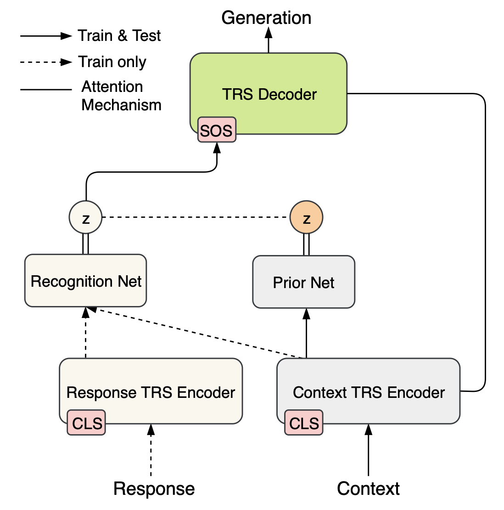
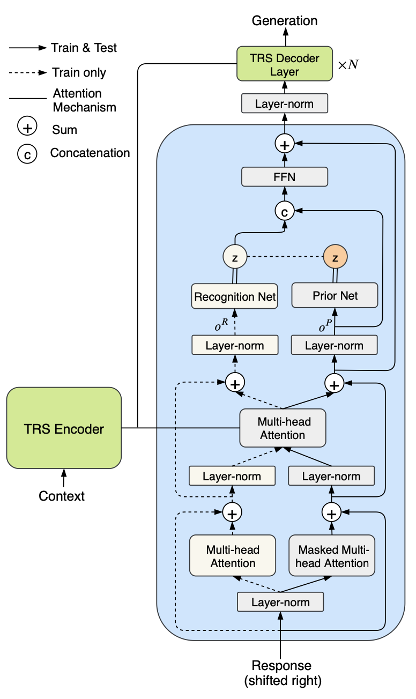

# Variational-Transformer
 [](https://opensource.org/licenses/MIT) 


:high_brightness: This is the PyTorch implementation of the paper:

**Variational Transformers for Diverse Response Generation**. [**Zhaojiang Lin**](https://zlinao.github.io/), Genta Indra Winata, Peng Xu, Zihan Liu, Pascale Fung  [[PDF]](https://arxiv.org/pdf/2003.12738.pdf)

This code has been written using PyTorch >= 0.4.1. If you use any source codes or datasets included in this toolkit in your work, please cite the following paper. The bibtex is listed below:
<pre>
@article{lin2020variational,
  title={Variational Transformers for Diverse Response Generation},
  author={Lin, Zhaojiang and Winata, Genta Indra and Xu, Peng and Liu, Zihan and Fung, Pascale},
  journal={arXiv preprint arXiv:2003.12738},
  year={2020}
}
</pre>

## Global Variational Transformer (GVT):
<p align="center">

</p>
The GVT is the extension of CVAE in Zhao et al. (2017), which modeling the discourse-level diversity with a global latent variable.

## Sequential Variational Transformer (SVT):
<p align="center">

</p>
SVT, inspired by variational autoregressive models (Goyal et al., 2017; Du et al., 2018), incorporates a sequence of latent variables into decoding process by using a novel variational decoder layer. Unlike previous approaches (Zhao et al., 2017; Goyal et al., 2017; Du et al., 2018), SVT uses Non-causal Multi-head Attention, which attend to future tokens for computing posterior latent variables instead of using an additional encoder. 

## Dependency
Check the packages needed or simply run the command
```console
❱❱❱ pip install -r requirements.txt
```
[**Pre-trained glove embedding**](http://nlp.stanford.edu/data/glove.6B.zip): ***glove.6B.300d.txt*** inside folder /vectors/.


## Experiment
***Dataset***

Three datasets (Mojitalk, PersonaChat, EmpatheticDialogue) are used in this work. Mojitalk is single-turn dialogue dataset, PersonaChat and EmpatheticDialogue are multiturn dialogue datasets. EmpatheticDialogue is preprocessed and stored in npy format: sys_dialog_texts.train.npy, sys_target_texts.train.npy, sys_emotion_texts.train.npy which consist of ***parallel*** list of context (source), response (target) and emotion label (additional label). 

***Single turn dialogue***

Transformer (train&test)
```console
❱❱❱ python3 main.py --model trs --emb_dim 300 --hidden_dim 300 --hop 4 --heads 4 --cuda --batch_size 128 --lr 0.001 --pretrain_emb --kl_ceiling 0.48 --aux_ceiling 1 --full_kl_step 20000 --save_path save/trs_new_bow_batch/ > save/trs_new_bow_batch/out.txt

```

Use the trained Transformer to initialize GVT: replace model_8999_82.7771_0.0000_0.0000_0.0000_0.0000 with your checkpoint.

GVT (train&test)
```console
❱❱❱ python3 main.py --model cvaetrs --emb_dim 300 --hidden_dim 300 --hop 4 --heads 4 --cuda --batch_size 128 --lr 0.001 --pretrain_emb --kl_ceiling 0.08 --aux_ceiling 1 --full_kl_step 15000 --save_path_pretrained save/trs_new_bow_batch/model_8999_82.7771_0.0000_0.0000_0.0000_0.0000 --save_path save/cvae_new_bow_batch0.08/ > save/cvae_new_bow_batch0.08/out.txt

```


Same here we pre-trained SVT with MLE
```console
❱❱❱ python3 main.py --model trs --v2 --emb_dim 300 --hidden_dim 300 --hop 4 --heads 4 --cuda --batch_size 128 --lr 0.001 --pretrain_emb --kl_ceiling 0.08 --aux_ceiling 1 --full_kl_step 20000 --num_var_layers 1 --save_path save/trs_v2/ > save/trs_v2/out.txt

```
Use the trained Transformer to initialize SVT: replace model_8999_4.4207_83.1528_0.0000_0.6200_0.0000 with your checkpoint.

SVT (train&test)
```console
❱❱❱ python3 main.py --model cvaetrs --v2 --emb_dim 300 --hidden_dim 300 --hop 4 --heads 4 --cuda --batch_size 16 --lr 0.0002 --pretrain_emb --kl_ceiling 0.3 --aux_ceiling 1 --full_kl_step 30000 --num_var_layers 1 --save_path_pretrained save/trs_v2/model_8999_4.4207_83.1528_0.0000_0.6200_0.0000 --save_path save/cvae_trs_v2_0.3/ > save/cvae_trs_v2_0.3/out.txt

```


***Multiturn dialogue***

Transformer (train&test)
```console
❱❱❱ python3 main.py --model trs --emb_dim 300 --hidden_dim 300 --hop 4 --heads 4 --cuda --batch_size 32 --persona --lr 0.0002 --pretrain_emb --kl_ceiling 0.48 --aux_ceiling 1 --full_kl_step 20000 --dataset empathetic --save_path save/trs_ed_persona/ > save/trs_ed_persona/out.txt

```
Interact with Transformer
```console
❱❱❱ python3 interact.py --model trs --cuda --persona --dataset empathetic --save_path_pretrained save/trs_ed_persona/model_8999_4.0222_55.8249_0.0000_0.0000_0.0000

```

Use the trained Transformer to initialize GVT: replace model_5999_4.0928_59.9090_0.0000_1.8200_0.0000 with your checkpoint.

GVT (train&test)
```console
❱❱❱ python3 main.py --model cvaetrs --emb_dim 300 --hidden_dim 300 --hop 4 --heads 4 --cuda --batch_size 32 --persona --lr 0.0002 --pretrain_emb --kl_ceiling 0.05 --aux_ceiling 1 --full_kl_step 12000 --dataset empathetic --save_path_pretrained save/trs_ed_persona/model_5999_4.0928_59.9090_0.0000_1.8200_0.0000 --save_path save/cvae_trs_ed_persona_0.05/ > save/cvae_trs_ed_persona_0.05/out.txt

```
Interact with GVT
```console
❱❱❱ python3 interact.py --model cvaetrs --cuda --persona --dataset empathetic --save_path_pretrained save/cvae_trs_ed_persona_0.05/model_12999_22.3743_22.9358_0.0000_0.0000_19.2416

```


Same here we pre-trained SVT with MLE
```console
❱❱❱ python3 main.py --model trs --v2 --emb_dim 300 --hidden_dim 300 --hop 4 --heads 4 --cuda --batch_size 32 --persona --lr 0.0002 --pretrain_emb --num_var_layers 1 --kl_ceiling 0.05 --aux_ceiling 1 --full_kl_step 12000 --dataset empathetic --save_path save/trs_ed_persona_v2/ > save/trs_ed_persona_v2/out.txt

```
Use the trained Transformer to initialize SVT: replace model_7999_4.0249_55.9739_0.0000_2.0900_0.0000 with your checkpoint.

SVT (train&test)
```console
❱❱❱ python3 main.py --model cvaetrs --v2 --emb_dim 300 --hidden_dim 300 --hop 4 --heads 4 --cuda --batch_size 2 --persona --gradient_accumulation_steps 16 --lr 0.0002 --pretrain_emb --num_var_layers 1 --kl_ceiling 0.6 --aux_ceiling 1 --full_kl_step 12000 --dataset empathetic --save_path_pretrained save/trs_ed_persona_v2/model_7999_4.0249_55.9739_0.0000_2.0900_0.0000 --save_path save/v2_cvae_trs_ed_persona_0.6/ > save/v2_cvae_trs_ed_persona_0.6/out.txt

```
Interact with SVT
```console
❱❱❱ python3 interact.py --model cvaetrs --v2 --cuda --persona --dataset empathetic --save_path_pretrained save/v2_cvae_trs_ed_persona_0.6/model_15999_4.5419_18.7720_0.0000_0.0000_1.6095 --num_var_layers 1

```
